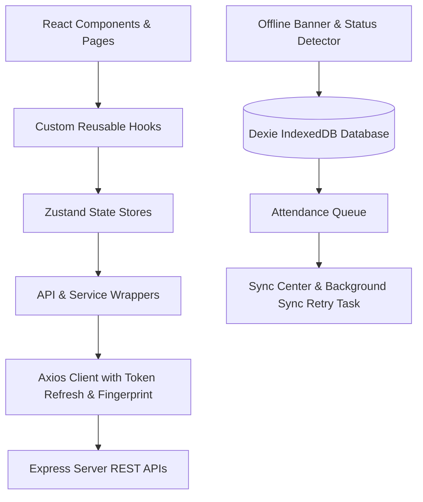
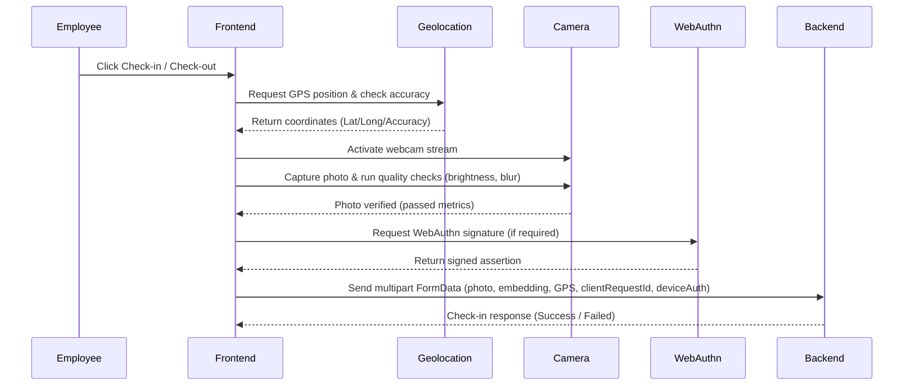
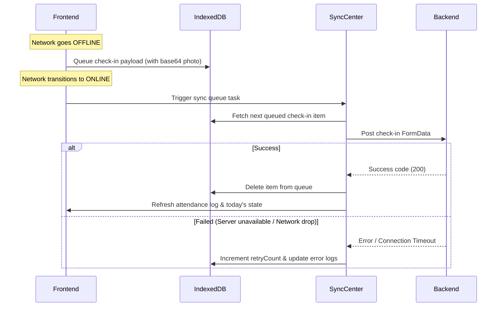

# ChamCong PWA - Employee Application

ChamCong PWA is a modern, high-performance Progressive Web Application (PWA) designed for field employees to perform secure check-in/check-out transactions at assigned work locations using camera capture, facial quality metrics verification, GPS positioning signals accuracy verification, and device-bound biometric verification (WebAuthn).

---

## 1. Architecture

The application is built as a single-page client application running entirely inside the user's browser, structured using state-of-the-art React patterns:



### Key Architectural Flow Diagrams:

#### A. Attendance Flow


#### B. Offline Synchronization Flow


---

## 2. Technology Stack

* **Core Framework**: React 19, Vite 5
* **Routing**: React Router DOM 7
* **State Management**: Zustand
* **Form Validation**: React Hook Form, Zod
* **Offline Storage**: Dexie (IndexedDB Wrapper)
* **API Client**: Axios (with silent access token refresh, device fingerprint header)
* **Styling**: Modern Custom CSS variables and layout helper classes (Application-Control compliant)
* **Icon Set**: React Icons (Remix Icons package)
* **Utility Libraries**: Day.js

---

## 3. Directory Structure

```text
c:/Users/ACER/CHAMCONG_APP/
├── public/                 # Static public files
│   ├── sw.js               # Service Worker for PWA assets caching
│   └── favicon.ico
├── src/
│   ├── api/
│   │   └── apiClient.js    # Centralized Axios interceptors
│   ├── components/
│   │   └── layout/
│   │       ├── BottomNavigation.jsx
│   │       ├── OfflineBanner.jsx
│   │       └── TopAppBar.jsx
│   ├── hooks/              # Custom state hook abstraction layer
│   │   ├── useAuth.js
│   │   ├── useAssignment.js
│   │   ├── useAttendance.js
│   │   ├── useFaceProfile.js
│   │   ├── useNotification.js
│   │   ├── useOffline.js
│   │   └── useProfile.js
│   ├── indexeddb/
│   │   └── db.js           # Dexie IndexedDB schemas and tables
│   ├── layouts/
│   │   ├── MainLayout.jsx
│   │   └── RouteGuardLayout.jsx
│   ├── pages/              # Main page views
│   │   ├── Assignments.jsx
│   │   ├── Attendance.jsx
│   │   ├── Dashboard.jsx
│   │   ├── Login.jsx
│   │   ├── Notifications.jsx
│   │   ├── Profile.jsx
│   │   ├── Settings.jsx
│   │   ├── SyncCenter.jsx
│   │   └── Unauthorized.jsx
│   ├── routes/
│   │   └── AppRoutes.jsx   # Client-side router path mappings
│   ├── services/           # Backend REST API wrappers
│   │   ├── authService.js
│   │   ├── assignmentService.js
│   │   ├── attendanceService.js
│   │   ├── faceProfileService.js
│   │   └── profileService.js
│   ├── store/              # Zustand central state engines
│   │   ├── authStore.js
│   │   ├── assignmentStore.js
│   │   ├── attendanceStore.js
│   │   ├── faceProfileStore.js
│   │   ├── notificationStore.js
│   │   ├── offlineStore.js
│   │   └── syncStore.js
│   ├── utils/
│   │   ├── faceBiometrics.js
│   │   └── webauthn.js
│   ├── validators/
│   │   └── authValidator.js
│   ├── App.css
│   ├── App.jsx
│   ├── index.css           # Global typography & layout engine
│   └── main.jsx            # Mounting file and PWA registration
├── vite.config.js          # Vite building config
├── package.json
└── README.md
```

---

## 4. Environment Variables

Create a `.env` file at the root of the project with the following configuration:

```env
# Backend API Base Path
VITE_API_URL=http://192.168.1.42:3000

# Device configuration
VITE_DEVICE_ID=pwa-client-id-001
```

---

## 5. Installation & Execution

### Prerequisites
* **Node.js**: v20.12.0+ (Tested under v20.12.2)
* **npm**: v10.5.0+

### Setup Commands
1. **Navigate to workspace**:
   ```bash
   cd c:\Users\ACER\CHAMCONG_APP
   ```

2. **Clean Install dependencies**:
   ```bash
   npm install
   ```

3. **Run Development Server**:
   ```bash
   npm run dev
   ```
   Open `http://192.168.1.42:5173` in your browser.

4. **Build Production Bundle**:
   ```bash
   npm run build
   ```
   The compiled static files will be placed inside the `dist/` directory.

---

## 6. Deployment Guide

To deploy the build output:
1. Compile the production bundle: `npm run build`.
2. The output directory is `dist/`. You can serve this directory using a static file web server (e.g., Nginx, Apache, or PM2 serve) or deploy it to cloud platforms like Vercel, Netlify, or AWS S3.
3. Make sure to serve the application over **HTTPS** (WebAuthn, Geolocation, and Camera APIs require a secure context to work in browsers). 192.168.1.42 is exempt from HTTPS requirements for development.
